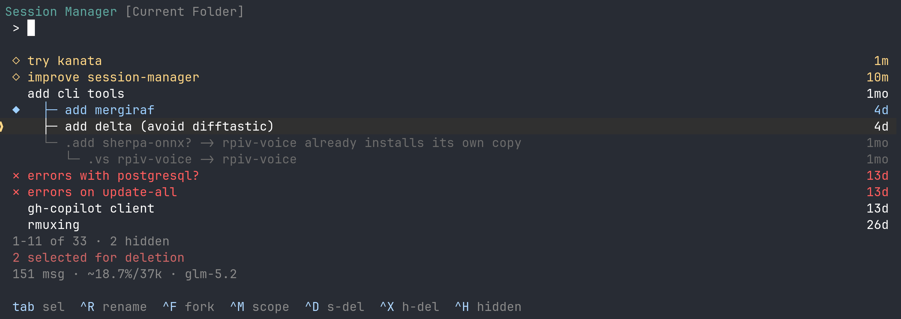

# pi-sm

Lite session manager for the [pi](https://pi.dev) coding agent.

<picture>
    
</picture>

An interactive TUI to **browse, search, rename, fork, hide, and delete** pi
sessions — plus a quick `/rn` command. Two extensions ship in this package:

| Extension       | Command | What it does                                                        |
| --------------- | ------- | ------------------------------------------------------------------- |
| `src/index.ts`  | `/sm`   | Full-screen session browser: list, filter, rename, fork, delete.    |
| `src/rename.ts` | `/rn`   | Rename the current session inline (`/rn [name]`, or `/rn` to edit). |

## Install

```fish
# install (persists to pi settings)
pi install git:github.com/well1791/pi-sm

# or try it once for the current session only
pi -e git:github.com/well1791/pi-sm
```

After installing, run `/sm` or `/rn` inside pi.

## `/sm` — session browser

Opens a full-screen TUI over your sessions.

### Navigation

| Key                   | Action                                                             |
| --------------------- | ------------------------------------------------------------------ |
| `↑` / `↓`             | Move cursor                                                        |
| `PageUp` / `PageDown` | Jump by 8                                                          |
| `Enter`               | Resume session · create session (on empty search) · confirm rename |
| `Tab`                 | Toggle selection on focused session                                |
| `Esc`                 | Cancel rename · clear selection · exit                             |

### Actions

| Key      | Action                                                                                |
| -------- | ------------------------------------------------------------------------------------- |
| `Ctrl+X` | **Delete** — hard delete (trash if available, else `rm -rf`); cascades to descendants |
| `Ctrl+D` | **Soft delete** — toggle hide/unhide via `.`-name prefix; includes descendants        |
| `Ctrl+R` | **Rename** the focused session                                                        |
| `Ctrl+F` | **Fork** the focused session (pick a branch point)                                    |
| `Ctrl+M` | Toggle **scope**: current project ↔ all sessions                                      |
| `Ctrl+H` | Toggle showing **hidden** sessions                                                    |

### Search / text input

Type to filter sessions by name and first message. While focused on the query:

`Ctrl+A` / `Home` · `Ctrl+E` / `End` · `Alt+B` / `Alt+F` (word jumps) ·
`←` / `→` · `Ctrl+W` (delete word) · `Ctrl+K` (delete to end) · `Ctrl+U` (clear) ·
`Backspace` / `Delete`.

When the search has no matches, `Enter` on the create row makes a new session
with the typed name.

### Resume with model mismatch check

Resuming a session saved under a different model prompts you to keep the active
model or switch to the session's model.

## `/rn` — quick rename

```fish
/rn my session      # set name directly
/rn                 # open an editor pre-filled with the current/derived name
```

With no arguments, the current name is derived from the first user message if
unset.

## Configuration

Optional config file at `~/.pi/agent/pi-sm.json`:

```json
{
  "commands": {
    "rename": "rn"
  },
  "shortcuts": {
    "delete": "ctrl+x",
    "softDelete": "ctrl+d",
    "rename": "ctrl+r",
    "fork": "ctrl+f",
    "scope": "ctrl+m",
    "toggleHidden": "ctrl+h",
    "select": "tab"
  },
  "colors": {
    "active": "#9ED0FF",
    "recent": "#FFD787",
    "unnamed": "#FFAFAF",
    "hidden": "242",
    "subagent": "#FFD700",
    "border": "#5FA8A0",
    "text": "#FFFFFF",
    "muted": "245",
    "gold": "#FFD787",
    "error": "#FF5F5F",
    "shortcutKey": "#AFD7FF"
  }
}
```

- **commands** — override slash-command names. `rename` sets the quick-rename
  command (default `rn`); requires an extension reload to take effect.
- **shortcuts** — override any of the `/sm` action keys (values are key names as
  pi's `matchesKey` understands them).
- **colors** — any color key. Values are either hex (`"#RRGGBB"` → 24-bit) or an
  ANSI 256 palette code (e.g. `"242"`).

Unspecified keys keep their defaults.

## License

[MIT](./LICENSE)
